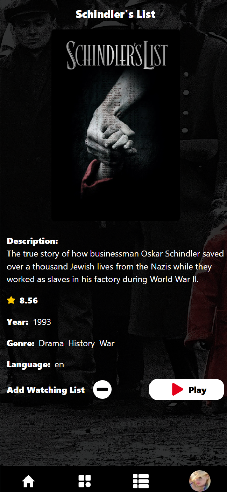
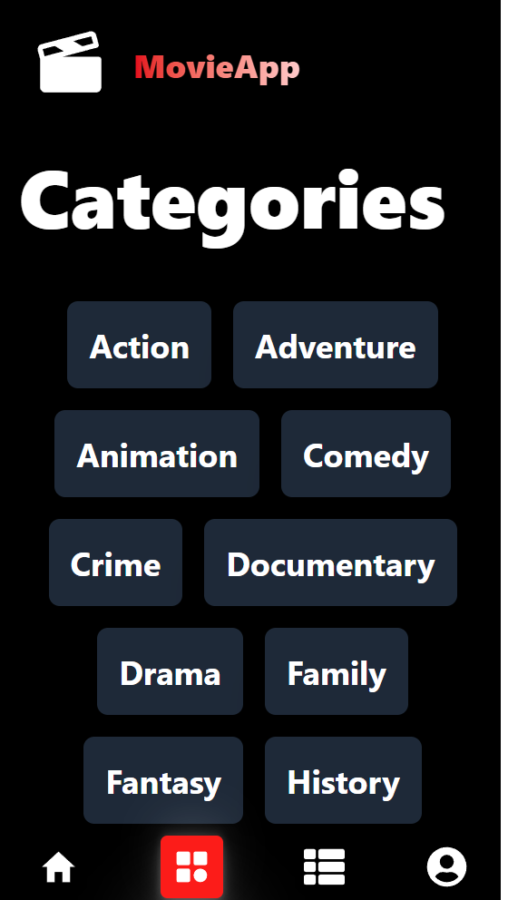
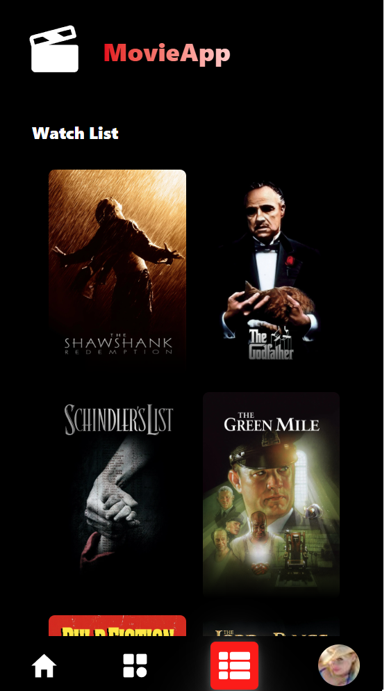

# 🎬 Movie App

A modern movie discovery app where users can explore popular films, watch trailers, and create their own watchlists after signing in. It features a user-friendly UI, high performance, and smooth animations.

## 🔗 Live Demo

[Visit the Live App](https://movie-app-furkan.netlify.app/)

## 📸 Screenshots

### Homepage


### Movie Detail



### Categories



### Watchlist



## 🚀 Features

- **Authentication**: Sign up & login functionality
- **Watchlist**: Personalized for each user
- **Trailers**: Watch via YouTube API
- **Performance**: Lazy loading & fast development with Vite
- **State Management**: Global state via Redux Toolkit
- **Responsive Design**: Tailwind CSS + Framer Motion animations
- **UX Enhancements**: Toast notifications & error handling

## 🛠️ Tech Stack

| Category           | Technologies                |
| ------------------ | --------------------------- |
| Frontend           | React.js, React Router DOM  |
| State Management   | Redux Toolkit               |
| Styling            | Tailwind CSS, Framer Motion |
| Forms & Validation | Formik, Yup                 |
| API Handling       | Axios                       |
| Notifications      | React Toastify              |
| Build Tool         | Vite                        |

## ⚙️ Installation

### 1. Clone the repository

```bash
git clone https://github.com/furkanarslan1/movie-app.git
cd movie-app


Install dependencies
npm install


 Start the development server
 npm run dev


 📁 Environment Variables

 Create a .env file in the root and add your TMDB API key:

 VITE_TMDB_API_KEY=your_tmdb_api_key_here

 You can get your API key here: https://www.themoviedb.org/settings/api


 🧼 Error Handling
The app includes proper error management to enhance user experience.
API errors and form validation feedback are shown using React Toastify.
```
